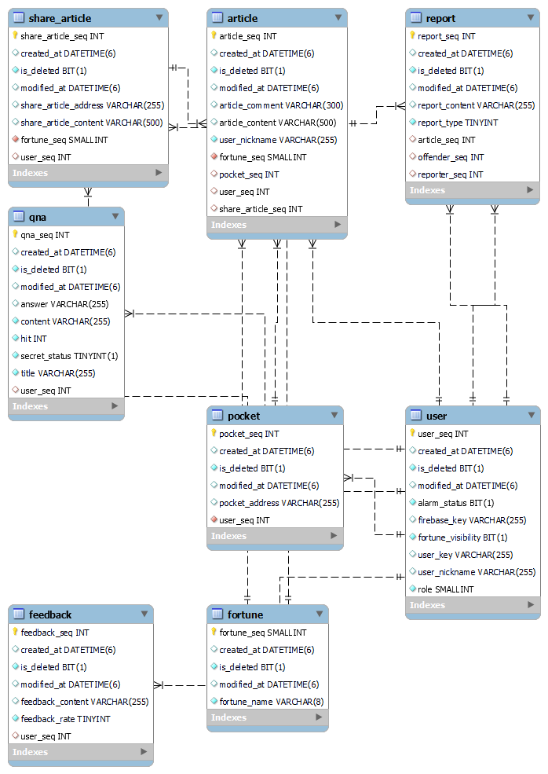
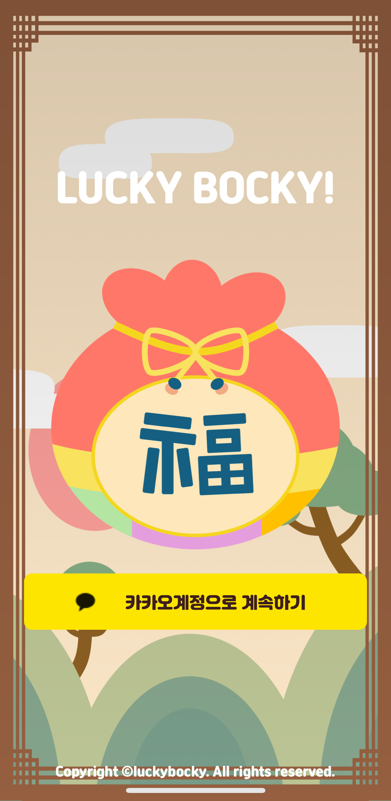
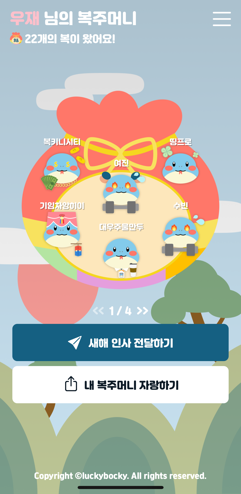
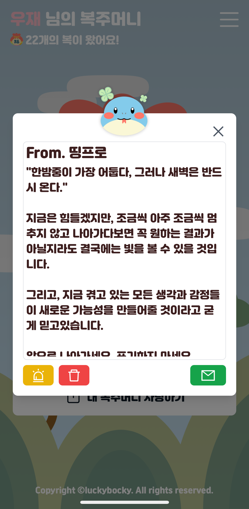
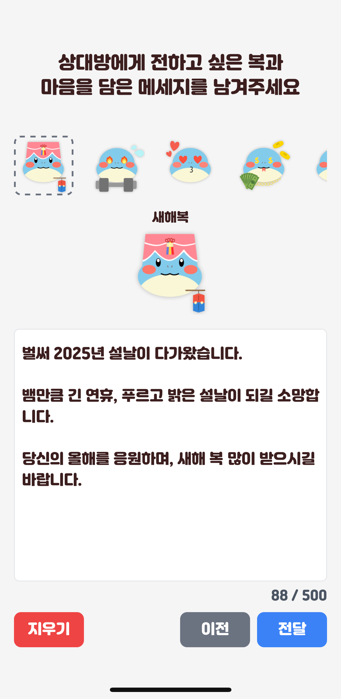
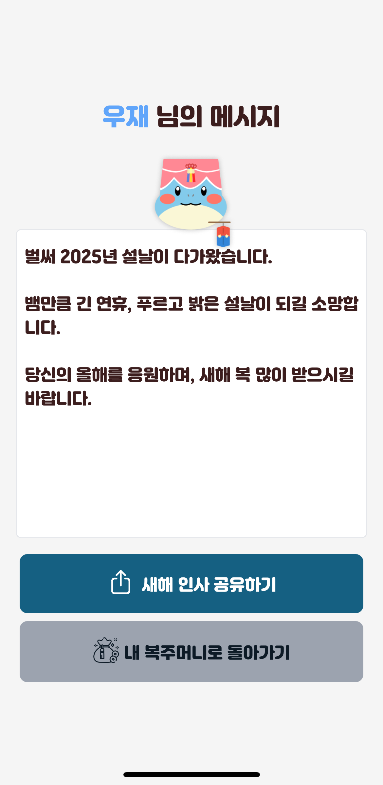
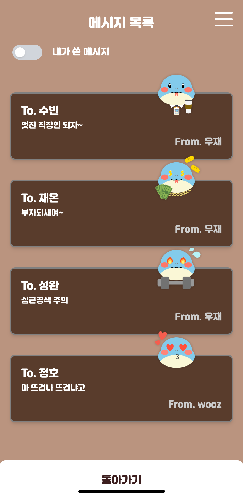
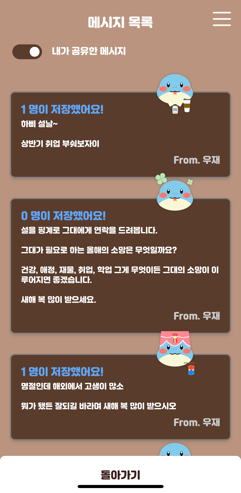
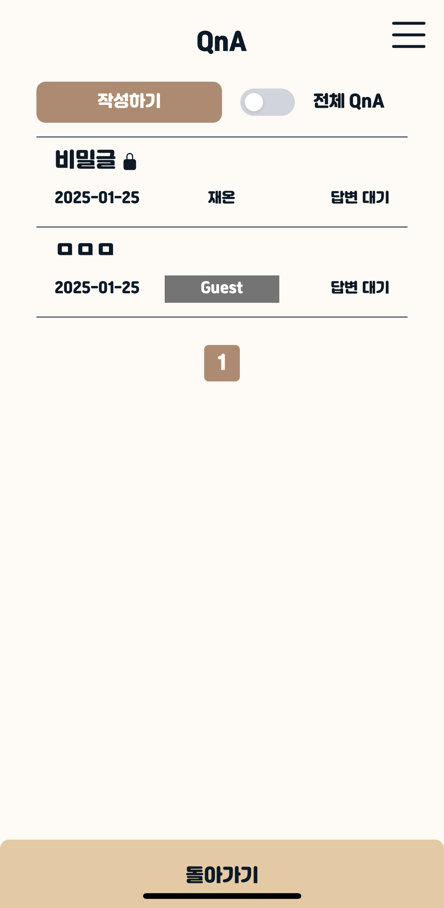
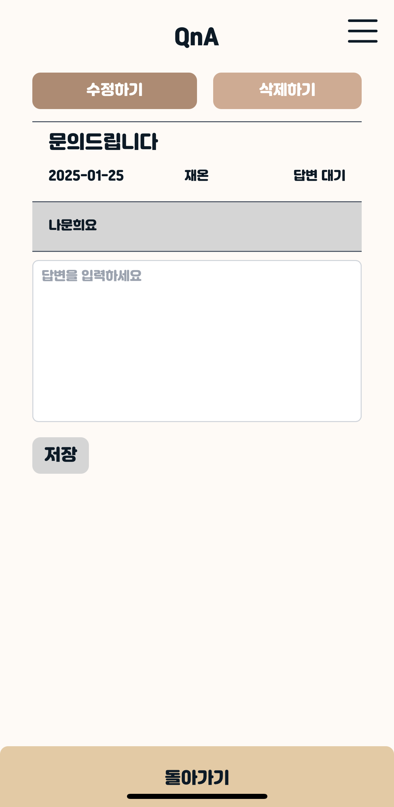

## 진행 배경
새해를 맞아 지인들과 나누는 안부를 보다 의미있게 간직하고 싶은 마음에서 출발했습니다.

## 진행 기간
**2024.12.16~2025.01.24(6weeks)**

## 기술 스택
### FE

### BE

### DB

### INFRA

## ERD

## 아키텍처

## 기능
### 로그인 페이지

### 나의 복 페이지

  
  

### 복 남기기 페이지

  
  

### 내가 남긴 복 페이지

  
  

### QnA 페이지

  
  

## :family: 팀 소개
<table>
  <tbody>
    <tr>
      <td align="center"><a href="https://github.com/changhi97"> <b>김창희</b></a> </td>
      <td align="center"><a href="https://github.com/seong-wan"> <b>이성완</b></a> </td>
      <td align="center"><a href="https://github.com/jaewonwi"> <b>위재원</b></a> </td>
      <td align="center"><a href="https://github.com/jo-dv"> <b>조우재</b></a> </td>
    </tr>
  </tbody>
</table>
